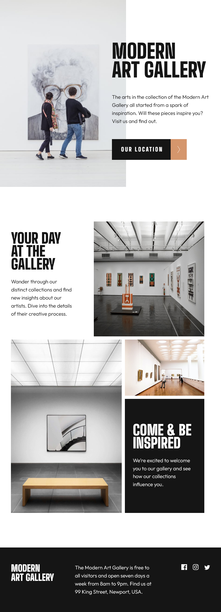
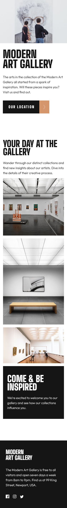

# Frontend Mentor - Art gallery website solution

This is a solution to the [Art gallery website challenge on Frontend Mentor](https://www.frontendmentor.io/challenges/art-gallery-website-yVdrZlxyA). Frontend Mentor challenges help you improve your coding skills by building realistic projects. 

## Table of contents

- [Overview](#overview)
  - [Screenshot](#screenshot)
  - [Links](#links)
- [My process](#my-process)
  - [Built with](#built-with)
  - [Useful resources](#useful-resources)
- [Author](#author)

## Overview

### Screenshot

### Links

- Solution URL: (https://github.com/Umlen/art-gallery-website)
- Live Site URL: (https://art-gallery-website-teal.vercel.app/)

## My process

### Built with

- Semantic HTML5 markup
- CSS custom properties
- Flexbox
- CSS Grid

### Useful resources

- [Example resource 1](https://codepen.io/aliencash/pen/MGoGXz?editors=1100) - This helped me with h1 header color.

## Author

- GitHub - [Viktor](https://github.com/Umlen)
- Frontend Mentor - [@Umlen](https://www.frontendmentor.io/profile/Umlen)

